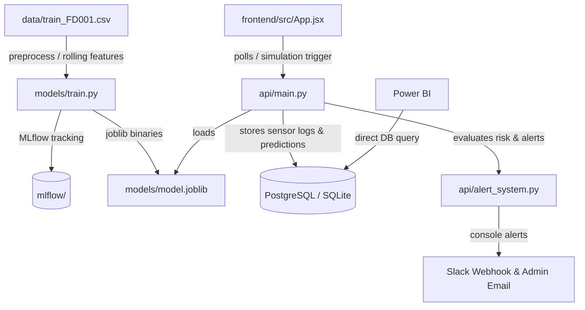

# AI Predictive Maintenance Platform

An end-to-end industrial Predictive Maintenance Platform powered by Machine Learning, simulating real-time telemetry from NASA's Turbofan Engine Degradation Simulation Dataset (CMAPSS).

The system predicts if an engine will break down within the next 30 cycles, raises warning/critical alerts, logs anomalies to a database, enables real-time cycle-by-cycle simulations, and tracks training parameters via MLflow.

---

## Technical Architecture



---

## Project Directory Map

- **`data/`**: Training & test CSV datasets (e.g., `train_FD001.csv` containing turbofan telemetry).
- **`models/`**: Pipeline training scripts (`train.py`) and inference logic (`predict.py`).
- **`api/`**: FastAPI backend covering Pydantic validation, SQLAlchemy queries, and alerting.
- **`frontend/`**: Vite + React SPA dashboard using glowing glassmorphism and SVG telemetry charting.
- **`database/`**: SQL initialization script defining columns, indices, and views for external analytics.
- **`dashboard/`**: Guide for connecting Power BI and DAX equations (MTBF, OEE).
- **`deployment/`**: Orchestration file (`docker-compose.yml`) for multi-container deployments.
- **`docker/`**: Service-specific Dockerfiles for containerization.
- **`mlflow/`**: Experiment database tracking hyperparameters and performance metrics.

---

## Getting Started

You can run the project either **locally with python** or via **Docker Compose**.

### Option A: Local Python & Node Setup (Recommended for Development)

#### 1. Pre-requisites
Ensure you have **Python 3.10+** and **Node.js 18+** installed.

#### 2. Install Python Dependencies
From the root directory:
```bash
pip install -r requirements.txt
```

#### 3. Train the Machine Learning Model
This executes preprocessing, rolls windows, trains XGBoost/Random Forest models, logs metadata, and outputs the model binary:
```bash
python models/train.py
```
*(Note: If you skip training, the backend will gracefully fall back to a rule-based physics engine based on engine cycles).*

#### 4. Run the FastAPI Backend
Start the uvicorn development server:
```bash
uvicorn api.main:app --reload --port 8000
```
- Access Swagger API docs: [http://localhost:8000/docs](http://localhost:8000/docs)
- The backend will auto-create `maintenance.db` (SQLite) and seed initial logs for Units 1, 2, and 3.

#### 5. Launch the React Frontend
Navigate to the frontend directory:
```bash
cd frontend
npm install
npm run dev
```
Open [http://localhost:5173](http://localhost:5173) in your browser.

---

### Option B: Run via Docker Compose (Orchestrated Stack)

This will spin up a PostgreSQL instance, MLflow server, FastAPI backend, and Nginx-based React frontend:

From the `deployment/` directory:
```bash
docker-compose up --build
```
- **React Dashboard**: [http://localhost:3000](http://localhost:3000)
- **FastAPI Endpoints**: [http://localhost:8000/docs](http://localhost:8000/docs)
- **MLflow Tracking Dashboard**: [http://localhost:5000](http://localhost:5000)
- **PostgreSQL**: Local port `5432`

---

## Core API Endpoints

- **`GET /api/dashboard/stats`**: Retrieves fleet summaries, OEE metrics, active alert counts, and latest machine statuses.
- **`POST /api/simulation/step?unit_number={N}`**: Advances the selected unit by 1 cycle (injects raw CSV data into backend, performs inference, logs results, and triggers alerts).
- **`GET /api/simulation/history/{unit_number}`**: Returns recent sensor values and failure risk history (used by React to draw line charts).
- **`POST /api/telemetry`**: Logs a raw sensor telemetry dictionary and returns predicted failure probabilities.
- **`GET /api/alerts`**: Returns active or historic alert logs.
- **`POST /api/retrain`**: Triggers a background model training cycle and dynamically reloads the best model.
- **`GET /api/monitoring`**: Returns model deployment performance details.
